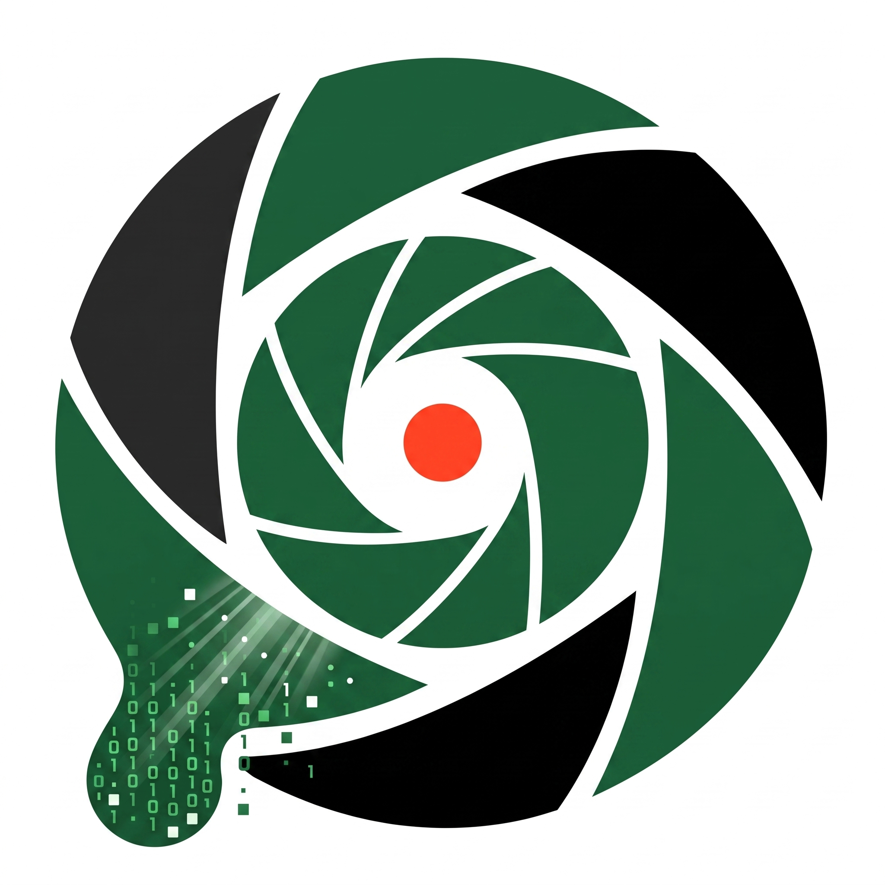

# DOA Watcher

<p align="center">
  
</p>

<p align="center">
  <b>DOA depozito iade makinelerini otomatik izler — boş göz bulununca haber verir.</b>
</p>

<p align="center">
  <a href="https://github.com/ozdensamet/doa-watcher/releases/latest/download/DOA-Watcher.zip">
    
  </a>
</p>

<p align="center">
  
  
  
  
  
</p>

---

## Özellikler

- **Tam otomatik giriş** — SMS ile gelen OTP kodunu Mac'in Mesajlar veritabanından okur, elle kod girmek yok
- **Akıllı bildirim** — yalnızca gidebileceğiniz bir makine varken e-posta atar, boşuna yola çıkarmaz
- **PET / Cam / Alüminyum** — izlenecek türleri seçin, doluluk eşiğini belirleyin
- **Yerleşik harita** — arama merkezini haritayı sürükleyerek seçin
- **Esnek zamanlama** — günlük kontrol saatlerini tek tek ekleyin, launchd gerisini halleder
- **Arka planda çalışır** — uygulamanın açık kalması gerekmez
- **Sıfır bağımlılık** — Swift + Python standart kütüphane, paket kurulumu yok

## Kurulum

[DOA-Watcher.zip](https://github.com/ozdensamet/doa-watcher/releases/latest/download/DOA-Watcher.zip)'i indirip ana dizininize açın — klasör `~/doa-watcher` konumuna oturmalı:

```bash
ditto -x -k ~/Downloads/DOA-Watcher.zip ~
open ~/doa-watcher/DOAWatcher.app
```

Ayarları girip **Kaydet**'e basın. Son adım, OTP'nin okunabilmesi için:

**Sistem Ayarları → Gizlilik ve Güvenlik → Tam Disk Erişimi → `+` → `~/doa-watcher/DOAWatcher.app`**

Uygulama noterlidir, ilk açılışta güvenlik uyarısı çıkmaz. Ana ekrandaki
gösterge, iznin gerçekten çalışıp çalışmadığını anlık gösterir.

**Kaynaktan derleme:**

```bash
git clone https://github.com/ozdensamet/doa-watcher.git ~/doa-watcher
cd ~/doa-watcher && ./build.sh
```

> Kaynaktan derlemede Developer ID sertifikası önerilir — ad-hoc imza her
> derlemede Tam Disk Erişimi iznini bozar. [Neden?](docs/teknik-notlar.md#kod-imzalama-ve-tam-disk-erişimi)

## Gereksinimler

- macOS 14+ ve telefon numarasıyla kayıtlı bir DOA hesabı
- iPhone → Mac SMS yönlendirmesi (Ayarlar → Mesajlar → Metin Mesajı Yönlendirme)
- Bildirimler için Gmail [uygulama şifresi](https://myaccount.google.com/apppasswords) — arayüzden bağlantısı var

## Nasıl çalışır

```
launchd ──▶ DOAWatcher.app ──▶ doa-checker.py ──▶ DOA API + Mesajlar DB + Gmail
```

Zamanı gelince OTP ister, SMS'i Mesajlar veritabanından okur, giriş yapıp
çevrenizdeki makineleri sorgular. Açık ve eşiğin altında dolulukta göz varsa
e-posta + macOS bildirimi gönderir.

## Sınırlamalar

- Mac'in kontrol saatinde açık olması gerekir; sürekli açık bir kurulum (ör. Mac mini) idealdir
- Her kontrol bir giriş, dolayısıyla bir OTP SMS'i tetikler
- DOA API'si resmî olarak belgelenmiş değildir; değişirse uyarlamak gerekir

## Gizlilik

Her şey yerelde çalışır. Telefon, e-posta ve Gmail şifresi yalnızca Mac'inizdeki
`config.json` dosyasında durur; üçüncü bir tarafa gönderilmez, repoya girmez.

## Dokümantasyon

- [DOA API notları](docs/api.md) — endpoint'ler, başlıklar, bilinen tuzaklar
- [Teknik notlar](docs/teknik-notlar.md) — yapılandırma, OTP okuma, kod imzalama / TCC, launchd, derleme ve dağıtım, sorun giderme

## Lisans

[MIT](LICENSE)
